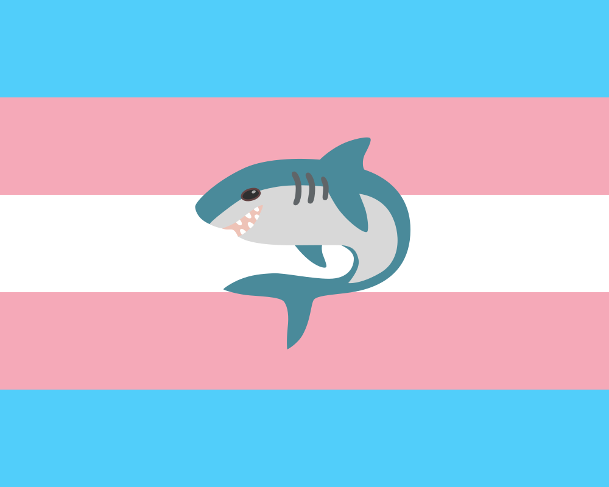

# Tranaland
Tout ce qui concerne Tranaland

Autres langues disponibles: [🇬🇧/🇺🇸](README.md)



## Qu'est-ce que Tranaland?
Tranaland est un pays virtuel qui existe dans l'esprit de ses citoyen·nes, AKA les personnes trans. C'est un endroit où chaque personne trans (non-binaire incluse) est la bienvenue, et tout le monde est libre d'être soi-même. Il est librement inspiré de Tanaland, un pays virtuel créé à des fins similaires, mais pour les femmes en général.

Il est largement entendu que les citoyennes de Tranaland peuvent également être citoyennes de Tanaland, et vice versa. Les deux pays ne sont pas mutuellement exclusifs.

La vidéo originale peut être trouvée [sur tiktok](https://vm.tiktok.com/ZGd1S6G2q/). Avec la raison pour laquelle le drapeau a changé de l'original, sur [cette vidéo](https://vm.tiktok.com/ZGd1ShBte/).
La vidéo originale de Tanaland peut également être trouvée [sur tiktok](https://www.tiktok.com/@hadja_bh2/video/7415329355255008544), elle a été créée par [@hadja_bh2](https://www.tiktok.com/@hadja_bh2).
En gros, le drapeau original avait une large bande blanche au milieu, qui est utilisée par les "MAPs", AKA les pédocriminels, pour s'identifier. Je ne le savais pas quand j'ai créé le drapeau, mais je l'ai changé dès que je l’ai appris, ne voulant pas être associé à de telles personnes.

### Les hommes trans et les personnes non-binaires

Comme mentionné précédemment, Tranaland est un endroit où **toutes** les personnes trans sont les bienvenues, donc les hommes trans et les personnes non-binaires sont également citoyen·nes de Tranaland. Je pensais que cela allait de soi, mais j'ai vu certaines personnes poser la question, donc voici un éclaircissement.

### Comment devenir citoyen·ne?

Pour devenir citoyen·ne de Tranaland, il vous suffit d'être trans. C'est tout. Vous n'avez pas besoin de faire autre chose. Vous n'avez pas besoin de demander la citoyenneté, vous n'avez pas besoin de payer de frais, vous n'avez pas besoin de passer de tests. Vous avez juste besoin d’être trans.

### Pourquoi le requin/Blåhaj?

Le requin est une référence au requin en peluche IKEA Blåhaj, qui est devenu un symbole dans la communauté trans. [Cliquez ici si vous voulez en savoir plus à ce sujet](https://fr.wikipedia.org/wiki/Symboles_LGBT#Requin_peluche) [NDLR: Désolée, c’est beaucoup moins fourni que la page anglophone].

### Comment puis-je modifier techniquement le drapeau?

Le drapeau est un simple fichier SVG, vous pouvez donc l'ouvrir avec n'importe quel éditeur de texte et le modifier à votre guise. Si vous voulez utiliser un éditeur graphique, je recommande [Inkscape](https://inkscape.org/), qui est libre et gratuit. Vous pouvez également utiliser n'importe quel autre éditeur graphique qui prend en charge les fichiers SVG.

Pour la version 9/16 pour tiktok/smartphone, il suffit de recadrer le drapeau à 275px de la gauche et de le redimensionner à 450px de large. Sur GIMP: Ouvrez le drapeau, laissez le rendu par défaut du fichier SVG, allez dans Image > Taille du canevas, définissez **Largeur** à 450px et le **Décalage X** à -275px, puis cliquez sur Redimensionner, vous pouvez ensuite exporter l'image en tant que fichier PNG. (La version carrée est de 800x800px, le décalage X est de -100)

### Comment a été généré le QR code?
Le QR code a été généré avec [amazing-qrcode](https://github.com/x-hw/amazing-qr), avec la commande suivante:
```bash
amzqr -v 10 -l M -p flag_square.png -c -n Github_qr.png https://github.com/FirePowi/Tranaland
# -v 10: Taille 10
# -l M: Correction d'erreur moyenne
# -p flag_square.png: Image de fond
# -c: Version colorée
# -n Github_qr.png: Nom du fichier de sortie
```

## Licences

Ce dépôt est sous licence [CC0 1.0](LICENSE). Vous êtes libre d'utiliser, de partager et de modifier le contenu de ce dépôt.

### Remerciements

Le requin vient de la police d’écriture [Noto Emoji](https://github.com/svgmoji/svgmoji/blob/main/packages/svgmoji__noto/svg/1F988.svg) qui est sous licence [SIL Open Font License 1.1](https://scripts.sil.org/cms/scripts/page.php?site_id=nrsi&id=OFL), le requin lui-même a été légèrement modifié par moi-même pour s'adapter au drapeau et aux couleurs du requin en peluche Blåhaj. MAIS le drapeau lui-même est sous licence [CC0 1.0](LICENSE), donc vous pouvez l'utiliser comme bon vous semble, avec ou sans ces remerciements, je veux juste donner du crédit là où il est dû, même si ce n'est [pas obligatoire](https://openfontlicense.org/how-to-use-ofl-fonts/).

